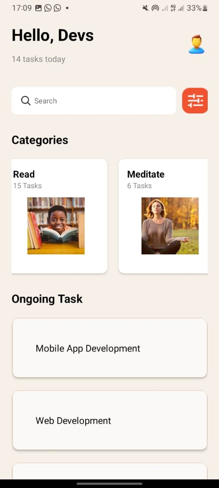

# MyApp

## Description

MyApp is a fantastic application designed to streamline your daily tasks. Whether you're managing projects, organizing your schedule, or collaborating with a team, MyApp has got you covered. With intuitive features and a user-friendly interface, staying productive has never been easier.

## Features

- Task Management: Create, organize, and prioritize tasks effortlessly.
- Calendar Integration: Sync your schedule with popular calendar apps for seamless planning.
- Collaboration Tools: Share tasks and projects with team members for efficient teamwork.
- Reminders: Set reminders to stay on track and never miss a deadline.
- Customization: Tailor MyApp to suit your workflow with customizable settings and themes.

## Installation

To install MyApp, follow these simple steps:

1. Clone the repository from GitHub: 
git clone https://github.com/Davelar1789/rn-assignment3-11253339.git

2. Navigate to the project directory:

cd MyApp

3. Install dependencies:

npm install

4. Start the application:

npm start

## Components
# HomeScreen
- Description: The main screen of the application displaying the greeting, task count, search bar, categories, and ongoing tasks.
- Usage: This screen integrates various components like CategoryCard, OngoingTaskItem, and uses a FlatList for rendering categories and ongoing tasks.
- File: screens/HomeScreen.js

# CategoryCard
- Description: A card component that displays the category title, number of tasks, and an image.
- Usage: Used within a horizontal FlatList to display different task categories.
- File: components/CategoryCard.js

# OngoingTaskItem
- Description: A component that displays the title of an ongoing task.
- Usage: Used within a FlatList to render the list of ongoing tasks.
- File: components/OngoingTaskItem.js

## Screenshots

Happy coding!
